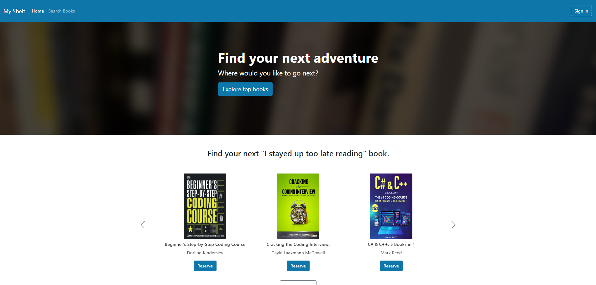
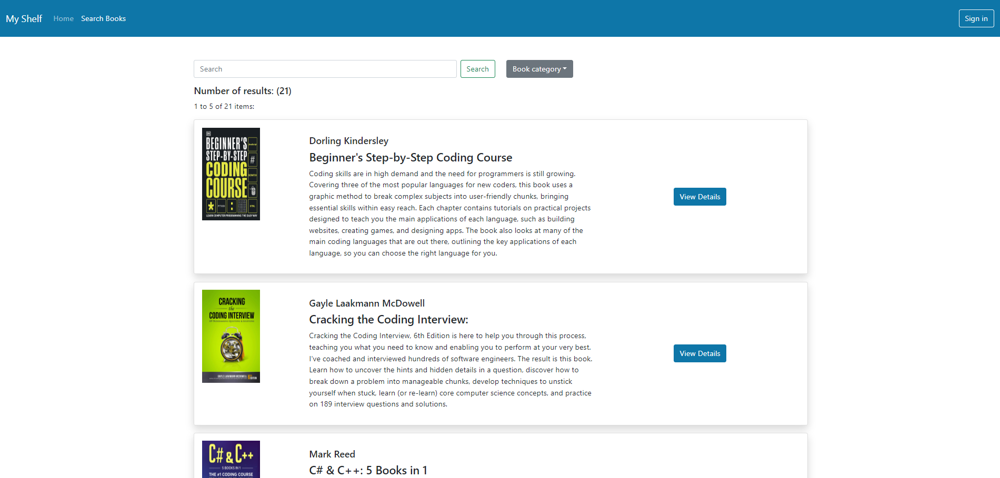
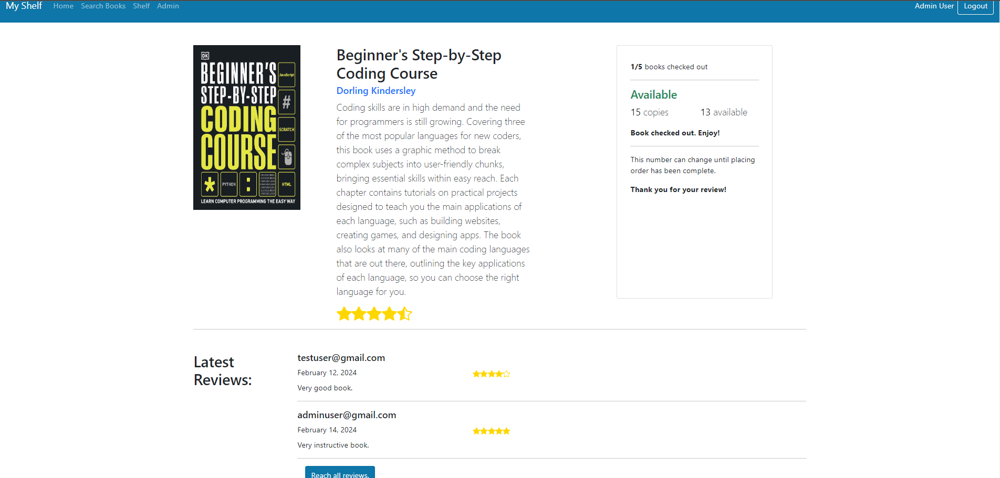
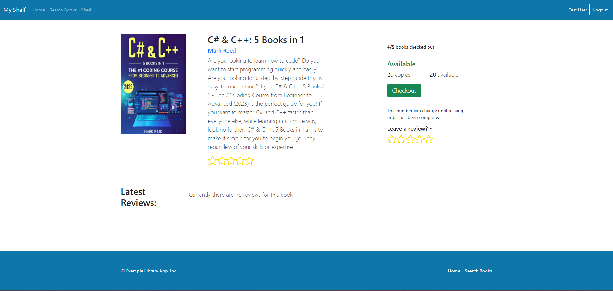
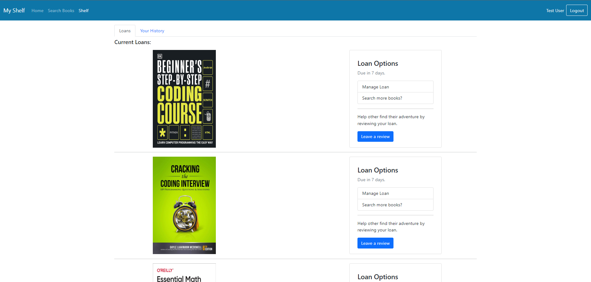
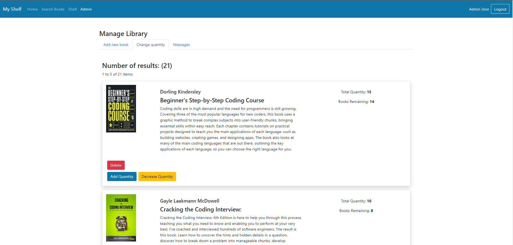
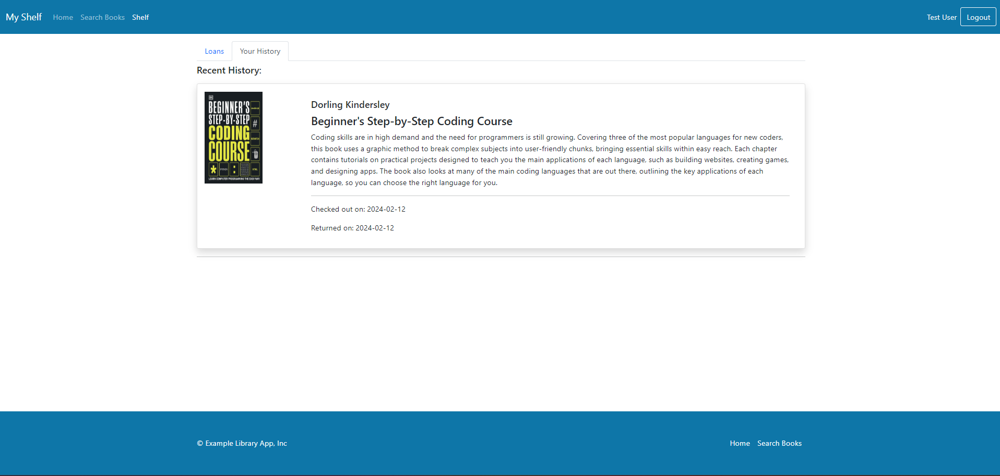
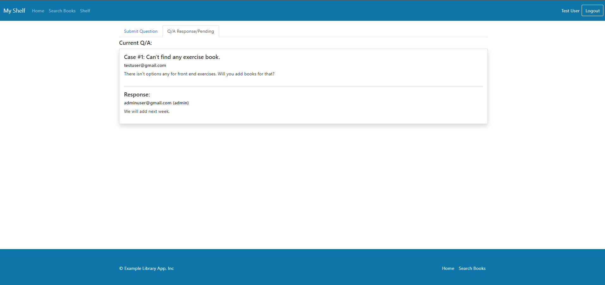
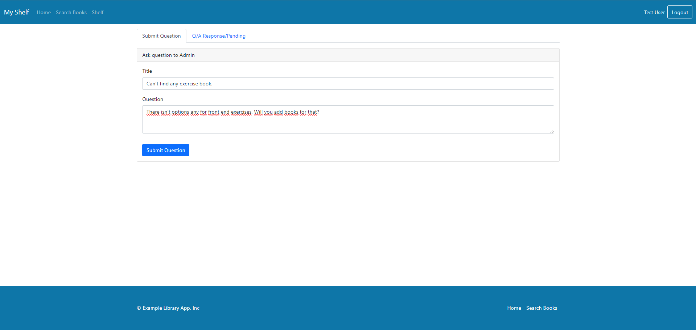

# library-app--react-spring-boot
Fullstack libarary application with react and spring boot.

## Table of Contents

1. [Introduction](#introduction)
2. [Installation and Usage](#installation-and-usage)
3. [Screenshots](#screenshots)

## Introduction
This full-stack library application is built using React for the frontend and Spring Boot for the backend. It allows users to manage a library database, including adding, removing, and updating books. The application provides a user-friendly interface for both librarians and patrons to interact with the library's collection.

### Frontend Technologies
The frontend of the application is developed using React.js with TypeScript for enhanced type safety and improved developer experience. React Router v5 is employed for managing page routes, ensuring smooth navigation within the application. Bootstrap is utilized for styling and providing a cohesive visual appearance to the pages, complemented by custom CSS for fine-tuning the design elements.

### Backend Technologies
The backend of the application is powered by Spring Boot, providing a robust framework for building scalable and efficient Java applications. Okta is integrated into the backend to handle user authentication and security, ensuring secure access to the application's resources. Additionally, Lombok is utilized to reduce boilerplate code and enhance developer productivity, allowing for cleaner and more maintainable code.


### Authentication and Security
For user authentication and security, the application integrates Okta, a robust authentication and authorization service. Okta ensures secure login and registration processes, providing users with a seamless and safe experience when accessing the application.

### Features
- **User Authentication**: Secure login and registration system using Okta security.
- **Home Page**: Featuring a carousel, navbar, footer, and hero section.
- **Books Page**: Displays all the books with pagination, search, and sort functionalities. Users can search for books by title, author, or category.
- **Book Page**: Shows detailed information about a book, including its reviews by users, ratings, available copies, and the ability to check the book out.
- **Shelf Page**: Allows users to manage their checked-out (loaned) books, including returning the book or extending the loan time.
- **Loan History Page**: Displays previous loan history for users to inspect.
- **Admin Features**: Admins have access to an admin page where they can add, delete, or update books in the library's collection.
- **Q/A Page**: Users can ask questions to admins for assistance.

The application is responsive and works well on both desktop and mobile devices.

## Installation and Usage

### Prerequisites
- Node.js version 18.17.1 or later
- Java Development Kit (JDK) 17

### Download
1. Clone the repository to your local machine:
   ```bash
   git clone https://github.com/omerfarukgulhan/library-management-app--react-spring-boot.git
   ```

### Start the Java Spring Server
1. Navigate to the server directory:
   ```bash
   cd library-app/server/src/main/java/com/libraryapp
   ```
2. Run the Java application:
   ```bash
   java LibraryappApplication.java
   ```

### Start the React Client
1. Navigate to the client directory:
   ```bash
   cd library-app/client
   ```
2. Install dependencies:
   ```bash
   npm install
   ```
3. Start the development server:
   ```bash
   npm start
   ```

### Access the Application
Once the server and client are running, you can access the application by opening your web browser and navigating to `http://localhost:3000`.

## Directory Structure
- `server`: Contains the Java Spring backend code.
- `client`: Contains the React frontend code.

Feel free to explore other directories and files to understand the project structure better.

## Screenshots

### Home Page


### Books Page


### Book Details


### Unchecked Book


### Shelf Page


### Admin Panel


### Loan History


### Q/A Page


### Message Panel



